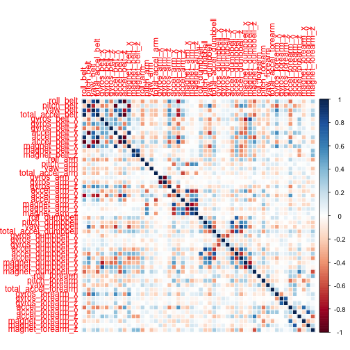
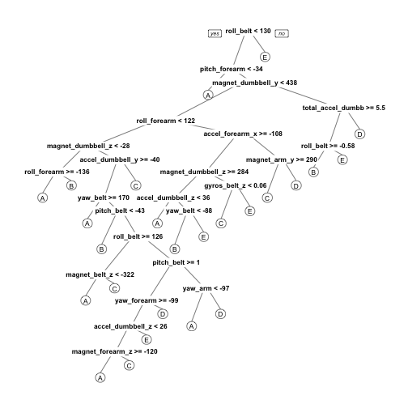

## Background
Using devices such as Jawbone Up, Nike FuelBand, and Fitbit it is now possible to collect a large amount of data about personal activity relatively inexpensively. These type of devices are part of the quantified self movement - a group of enthusiasts who take measurements about themselves regularly to improve their health, to find patterns in their behavior, or because they are tech geeks. One thing that people regularly do is quantify how much of a particular activity they do, but they rarely quantify how well they do it. In this project, your goal will be to use data from accelerometers on the belt, forearm, arm, and dumbell of 6 participants. They were asked to perform barbell lifts correctly and incorrectly in 5 different ways. More information is available from the website here: http://groupware.les.inf.puc-rio.br/har (see the section on the Weight Lifting Exercise Dataset).

## Introduction  
This is the final project of the practical machine learning course conducted by John Hopkins University. The goal of your project is to predict the manner in which they did the exercise. This is the "classe" variable in the training set. The total number of participants are six. Further we will be using a Prediction model to predict 20 different test cases. The software used for the analysis is R version 3.3.0.  

## Data
The data for the project was taken from http://groupware.les.inf.puc-rio.br/har. More information on the same can be found here. The training data for this project are available here: https://d396qusza40orc.cloudfront.net/predmachlearn/pml-training.csv and The test data are available here: https://d396qusza40orc.cloudfront.net/predmachlearn/pml-testing.csv. 
For the analysis, we are splitting the data into Training set and Testing set in the ratio 60:40. The training set consists of 11776 observations and 160 variables and the total number of observations in testing test are 7846 and 160 variables. 
To get better results we are cleaning the data before the main analysis. For this purpose, we removed all the variables with the near zero variances, removed the ID column and removed the variables with too many missing values (We removed the variables which have more than 60% missing values). The same was done for the test set too. In the end we were left with 11776 observations and 58 variables in the training set and 20 observations and 57 variables in the test data.

## Data Preprocessing  

```r
library(caret)
library(rpart)
library(rpart.plot)
library(randomForest)
library(corrplot)
```
### Download the Data

```r
trainUrl <-"https://d396qusza40orc.cloudfront.net/predmachlearn/pml-training.csv"
testUrl <- "https://d396qusza40orc.cloudfront.net/predmachlearn/pml-testing.csv"
trainFile <- "./data/pml-training.csv"
testFile  <- "./data/pml-testing.csv"
if (!file.exists("./data")) {
  dir.create("./data")
}
if (!file.exists(trainFile)) {
  download.file(trainUrl, destfile=trainFile, method="curl")
}
if (!file.exists(testFile)) {
  download.file(testUrl, destfile=testFile, method="curl")
}
```
### Read the Data
After downloading the data from the data source, we can read the two csv files into two data frames.  

```r
trainRaw <- read.csv("./data/pml-training.csv")
testRaw <- read.csv("./data/pml-testing.csv")
dim(trainRaw)
```

```
## [1] 11776   160
```

```r
dim(testRaw)
```

```
## [1]  20 160
```
The training data set contains 11776 observations and 160 variables, while the testing data set contains 20 observations and 160 variables. The "classe" variable in the training set is the outcome to predict.

### Clean the data
In this step, we will clean the data and get rid of observations with missing values as well as some meaningless variables.

```r
sum(complete.cases(trainRaw))
```

```
## [1] 406
```
First, we remove columns that contain NA missing values.

```r
trainRaw <- trainRaw[, colSums(is.na(trainRaw)) == 0]
testRaw <- testRaw[, colSums(is.na(testRaw)) == 0]
```
Next, we get rid of some columns that do not contribute much to the accelerometer measurements.

```r
classe <- trainRaw$classe
trainRemove <- grepl("^X|timestamp|window", names(trainRaw))
trainRaw <- trainRaw[, !trainRemove]
trainCleaned <- trainRaw[, sapply(trainRaw, is.numeric)]
trainCleaned$classe <- classe
testRemove <- grepl("^X|timestamp|window", names(testRaw))
testRaw <- testRaw[, !testRemove]
testCleaned <- testRaw[, sapply(testRaw, is.numeric)]
```
Now, the cleaned training data set contains 11766 observations and 58 variables, while the testing data set contains 20 observations and 57 variables. The "classe" variable is still in the cleaned training set.

### Slice the data
Then, we can split the cleaned training set into a pure training data set (60%) and a validation data set (40%). We will use the validation data set to conduct cross validation in future steps.  

```r
set.seed(22519) # For reproducibile purpose
inTrain <- createDataPartition(trainCleaned$classe, p=0.70, list=F)
trainData <- trainCleaned[inTrain, ]
testData <- trainCleaned[-inTrain, ]
```

## Data Modeling
We fit a predictive model for activity recognition using **Random Forest** algorithm because it automatically selects important variables and is robust to correlated covariates & outliers in general. We will use **5-fold cross validation** when applying the algorithm.  

```r
controlRf <- trainControl(method="cv", 5)
modelRf <- train(classe ~ ., data=trainData, method="rf", trControl=controlRf, ntree=250)
modelRf
```

```
## Random Forest
##
## 13737 samples
##    52 predictor
##     5 classes: 'A', 'B', 'C', 'D', 'E'
##
## No pre-processing
## Resampling: Cross-Validated (5 fold)
##
## Summary of sample sizes: 10989, 10989, 10991, 10990, 10989
##
## Resampling results across tuning parameters:
##
##   mtry  Accuracy   Kappa      Accuracy SD   Kappa SD    
##    2    0.9904636  0.9879361  0.0006534224  0.0008263772
##   27    0.9913374  0.9890405  0.0015731292  0.0019917940
##   52    0.9850766  0.9811193  0.0027732182  0.0035098533
##
## Accuracy was used to select the optimal model using  the largest value.
## The final value used for the model was mtry = 27.
```
Then, we estimate the performance of the model on the validation data set.  

```r
predictRf <- predict(modelRf, testData)
confusionMatrix(testData$classe, predictRf)
```

```
## Confusion Matrix and Statistics
##
##           Reference
## Prediction    A    B    C    D    E
##          A 1672    1    0    0    1
##          B    8 1127    4    0    0
##          C    0    1 1020    5    0
##          D    0    0   14  949    1
##          E    0    0    0    6 1076
##
## Overall Statistics
##                                          
##                Accuracy : 0.9978          
##                  95% CI : (0.9962, 0.9988)
##     No Information Rate : 0.2846         
##     P-Value [Acc > NIR] : < 2.2e-16      
##                                          
##                   Kappa : 0.9972         
##  Mcnemar's Test P-Value : NA             
##
## Statistics by Class:
##
##                     Class: A Class: B Class: C Class: D Class: E
## Sensitivity            0.9988   0.9991   0.9913   1.0000   0.9991
## Specificity            0.9998   0.9996   0.9998   0.9982   1.0000
## Pos Pred Value         0.9994   0.9982   0.9990   0.9907   1.0000
## Neg Pred Value         0.9995   0.9998   0.9981   1.0000   0.9998
## Prevalence             0.2846   0.1934   0.1757   0.1623   0.1840
## Detection Rate         0.2843   0.1932   0.1742   0.1623   0.1839
## Detection Prevalence   0.2845   0.1935   0.1743   0.1638   0.1839
## Balanced Accuracy      0.9993   0.9993   0.9955   0.9991   0.9995

```

```r
accuracy <- postResample(predictRf, testData$classe)
accuracy
```

```
##  Accuracy     Kappa
## 0.9978 0.9911870
```

```r
oose <- 1 - as.numeric(confusionMatrix(testData$classe, predictRf)$overall[1])
oose
```

```
## [1] 0.006966865
```
So, the estimated accuracy of the model is 99.78% and the estimated out-of-sample error is 0.22%.

## Predicting for Test Data Set
Now, we apply the model to the original testing data set downloaded from the data source. We remove the `problem_id` column first.  

```r
result <- predict(modelRf, testCleaned[, -length(names(testCleaned))])
result
```

```
##  [1] B A B A A E D B A A B C B A E E A B B B
## Levels: A B C D E
```

## Appendix: Figures
1. Correlation Matrix Visualization  

```r
corrPlot <- cor(trainData[, -length(names(trainData))])
corrplot(corrPlot, method="color")
```


2. Decision Tree Visualization

```r
treeModel <- rpart(classe ~ ., data=trainData, method="class")
prp(treeModel) # fast plot
```


